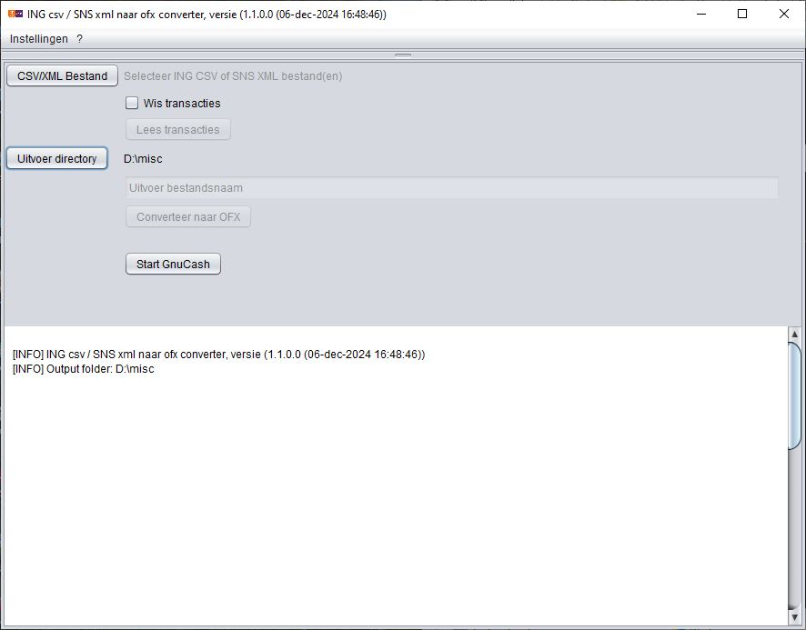
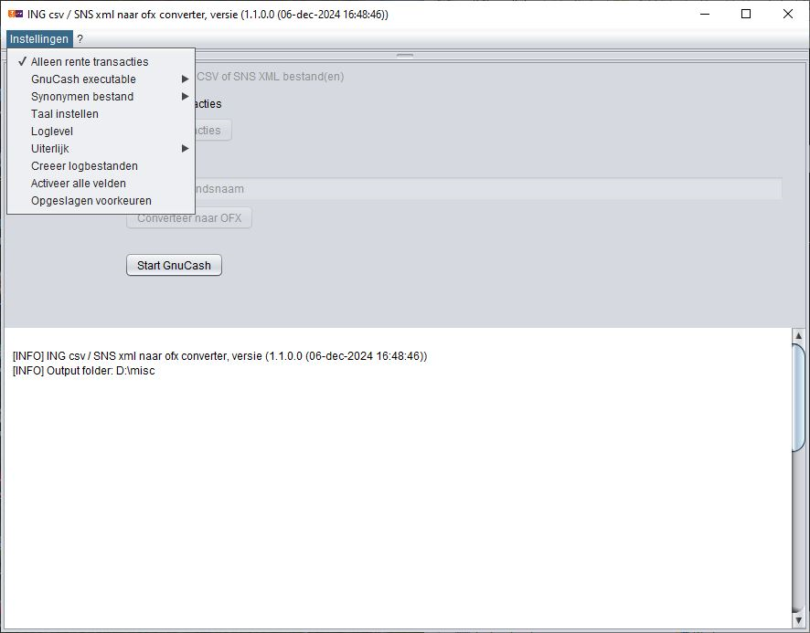

# Introduction
The intent of this (java) application  is to convert ING (www.ing.nl) csv- or SNS (www.snsbank.nl) xml-files to ofx files that can be read by a program like GnuCash (http://www.gnucash.org).

The origin is a Python script which can be found on Github:  https://github.com/chmistry/ing2ofx/releases.
The original script needed some modifications due to a new Python version and some changes in the ING CSV format.

Due to Python installation and versioning problems, this Java applicaton was born.
The Python script(s) are rewritten in Java.

The ofx specification can be downloaded from http://www.ofx.net/

A tutorial on how to keep your bank records in GnuCash can be read on:
http://www.chmistry.nl/financien/beginnen-met-boekhouden-in-gnucash/

# Installation
The following Windows installation kit is available:
- ing2ofx_v0.x.y.z_jre_setup.exe

The kit has a JRE onboard.

# Opening menu
When running the application (Windows excutable or Java jar-file) the following menu is shown:

Button _CSV File(s)_: one or more ING CSV file or SNS XML can be choosen.
- The application recognizes:
  - a comma or semicolon separated ING input file.
  - a SNS XML input file.
- The content "normal" or saving transactions.

Button _Output folder_: Point to the directory where the generated OFX-file(s) are stored. 
A proposal for the "Output filename" is made, this can be changed.

Button _Convert to OFX_: The conversion to OFX format is started, the progres is shown in the lower panel.
 
Button _Start GnuCash_: GnuCash is started.

# Setting menu

In the "settings" menu the following options are available:
- A ING CSV file may contain transactions for more then one account, all converted OFX transcations can be stored in one OFX file or per account a separate OFX file (default).
- "Only interest transaction" is used only for a ING CSV file with saving transactions.
- Where to find _GnuCash_ executable.
- For debugging a _loglevel_ can be defined, default is level _INFO_.
- _Look and Feel_ of the GUI can be adjusted.
- _Create logfiles_ in the choosen directory a HTML- and a textfile with logging is created.

# Transaction "fitting"
When a transaction is present in the input files of two different accounts, because it is a transfer between those accounts, then the "fit-id" is adjusted accordenly.
If there is a import correlation present that the transaction is coupled to the other account, then GnuCash will mark one of the transactions as a duplicate (and transaction is not imported).

For the transaction fitting the following rules are used:
- "Account" from is "Account to".
- Transaction dates are the same.
- Sum of amounts is zero.

# Synonym
An administration may have multiple bank accounts, and an input file may contain transactions for multiple accounts or administrations.
To determine for which account an OFX file is meant, a mechanism is available that is configured with a CSV file in the following format:

      Seq; AccountNr        ; Prefix
       1 ; NLIyyINGBxxxxxxx ; Home
       2 ; NLzzSNSBnnnnnnn  ; Business
       ......

This results in the following filenames:

   Home_NLIyyINGBxxxxxxx_&lt;InputFilename&gt;.ofx
   Business_NLzzSNSBnnnnnnn_&lt;InputFilename&gt;.ofx

The prefix may indicate the administration where the account is accounted for.

